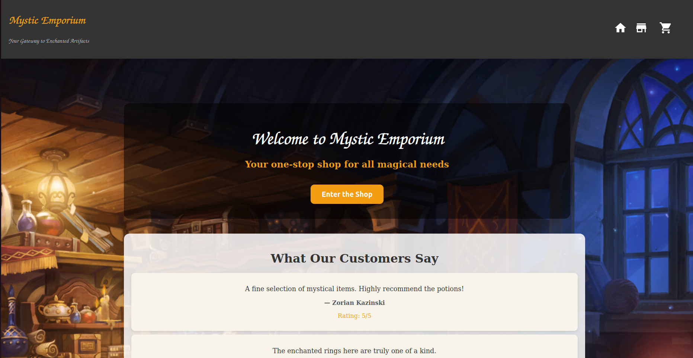

# Shopping Cart

## Description
Apply basic of React learned in order to create a shopping cart:
- TDD
- Client-side routing
- Styled Component

[Come see the live site](https://shopping-cart-odin-enuma.netlify.app/)

